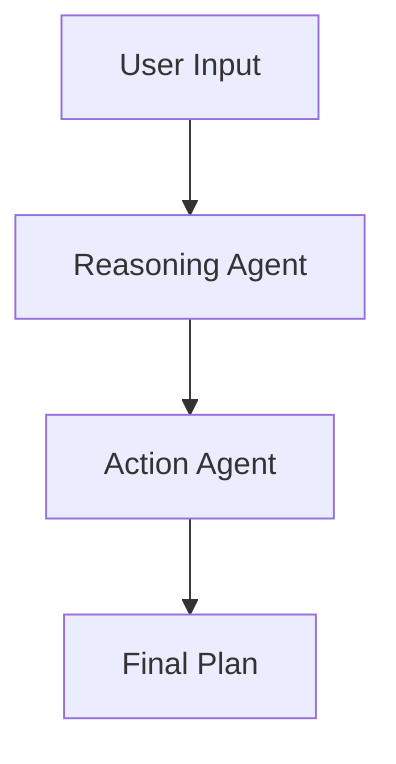

# Two-Step Reasoning & Action Agent

## Overview
This project demonstrates a simple two-step conversational agent built using LangChain and LangGraph. It separates the reasoning process into two distinct stages:

1. **Reasoning Stage**: Generates an intermediate "thought" by prompting the LLM to think step by step about the user input.
2. **Action Stage**: Constructs a concrete action plan based on the original input and the generated "thought".

A state machine (`StateGraph`) orchestrates these stages in sequence and produces both the reasoning trace and final plan.

---

## Features
- Modular agent design with clear separation of reasoning and planning.
- Uses Pydantic models (`AgentState`) to define and validate agent state.
- Easy-to-extend workflow graph via `StateGraph`.
- Visualization of the workflow as a Mermaid diagram.

---

## Requirements
- Python 3.8+
- `langchain`
- `langgraph`
- `pydantic`
- `openai` (for the `ChatOpenAI` integration)

Install dependencies via pip:

```bash
pip install langchain langgraph pydantic openai
```

---

## Usage
1. **Define the Agent State**
   - `AgentState` captures `input_text`, `thought`, and `output_action`.

2. **Implement Nodes**
   - `reasoning_agent`: Prompts the LLM to think step by step about the input.
   - `action_agent`: Builds an action plan using both input and intermediate thought.

3. **Build the Workflow**
   - Instantiate `StateGraph`, add nodes, set entry point, and define transitions.
   - Compile the graph to obtain an executable workflow.

4. **Invoke the Workflow**
   - Create an initial `AgentState` with the user request.
   - Call `graph.invoke(initial_state)` to execute reasoning and planning.

5. **Visualize the Graph**
   - Generate a Mermaid PNG diagram via `graph.get_graph(xray=1).draw_mermaid_png()`.

Example:

```python
# Prepare initial state
initial_state = AgentState(
    input_text="Build a 3-month plan to study the basics of English language",
    thought="",
    output_action=""
)

# Run the workflow
result = graph.invoke(initial_state)
print(result.thought)
print(result.output_action)

# Save workflow diagram
png = graph.get_graph(xray=1).draw_mermaid_png()
open("workflow.png", "wb").write(png)
```

---

## Architecture


- **StateGraph** manages transitions between nodes.
- **ChatOpenAI** provides the LLM backend for both stages.

---

## Extending the Agent
- Add more nodes for validation, execution, or feedback loops.
- Customize prompts or integrate additional tools.
- Adjust state schema to capture more context as needed.

---

## License
This project is released under the MIT License.

